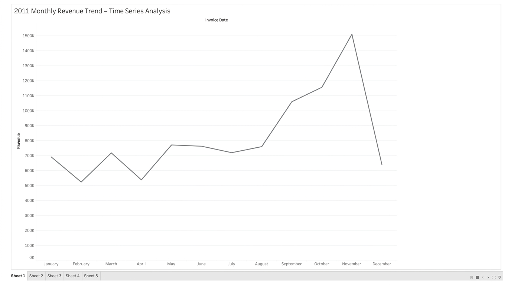
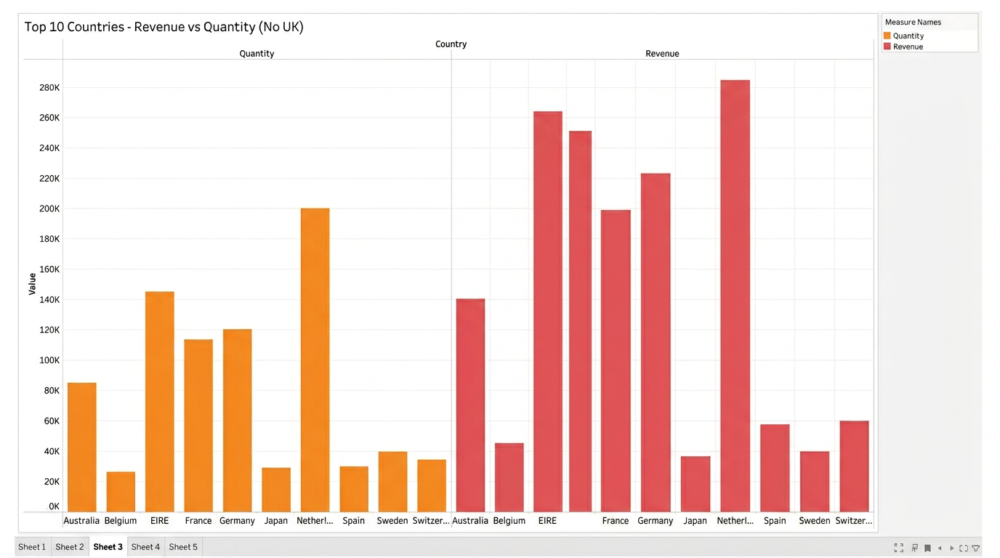
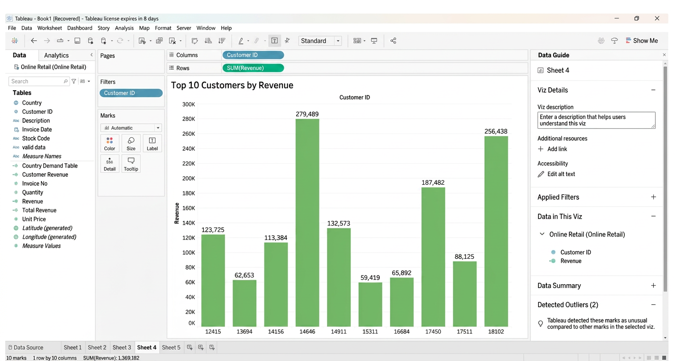
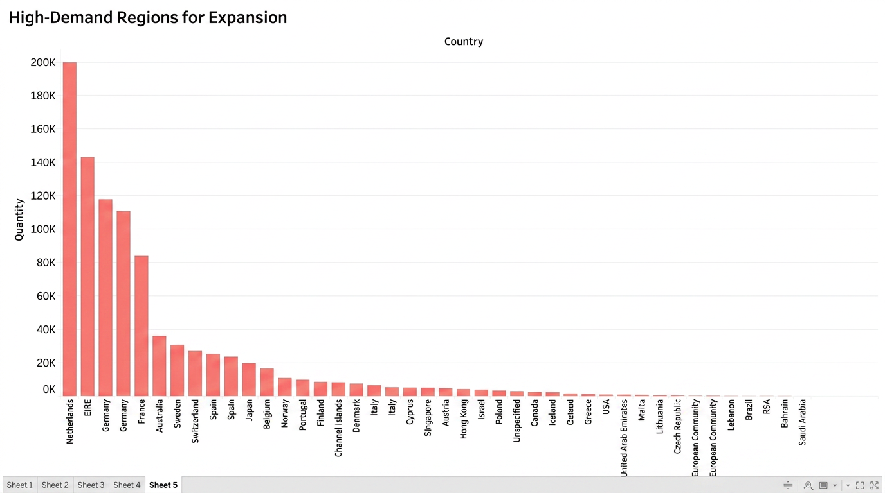
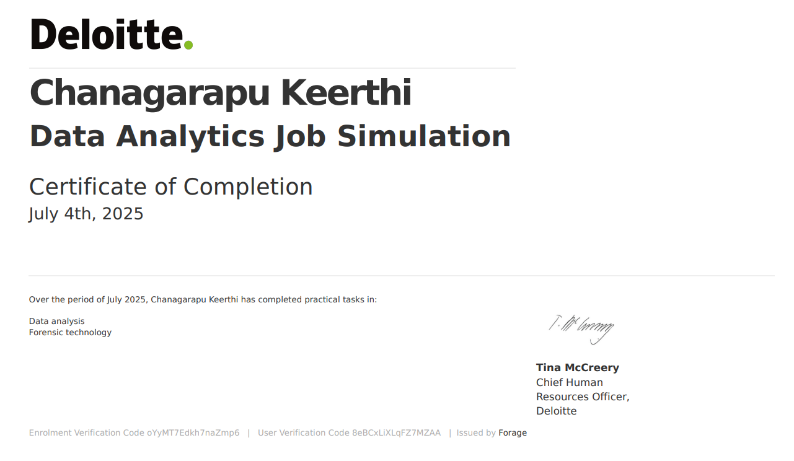
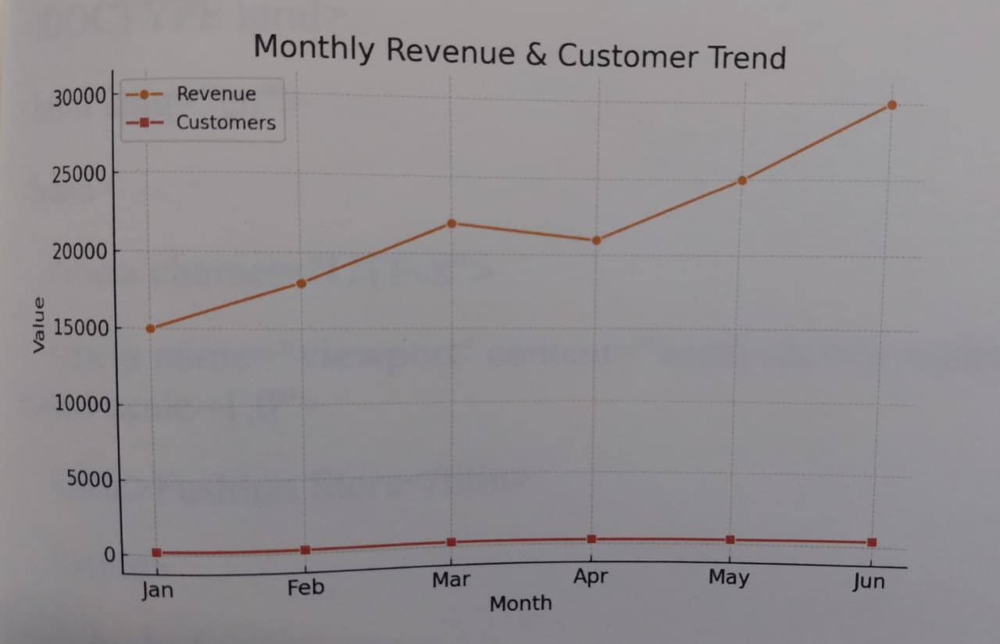
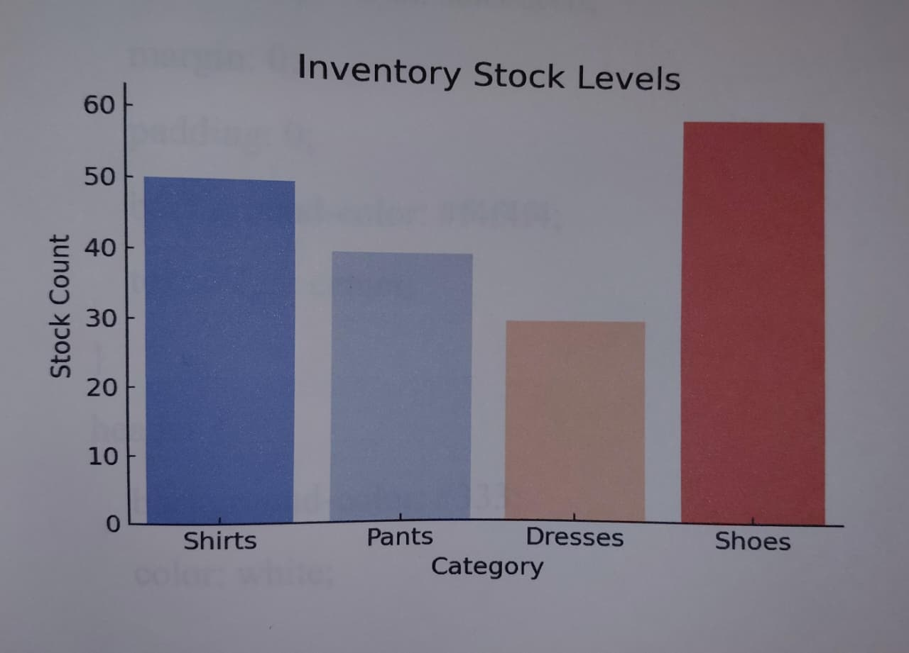

**Keerthi**

Data Analyst | Python & Tableau

I just finished Deloitte's virtual Data Analytics program through Forage. I like finding patterns in messy data and turning them into charts people can actually use. Looking for data analyst internships.

**Projects**

**1. Deloitte Data Analytics Simulation** - July 2025
Forage + Deloitte gave us raw client transaction data. I built 4 dashboards in Tableau to answer real business questions.

**What I looked at:**
- Monthly revenue for 2011 - spotted that November was huge at 1.5M but December crashed. Good to know for stock planning.

- Who our biggest customers are. Ranked them by total spend and by units bought so sales knows who to call first.

- Which UK regions order the most + which products actually make money there. Helps decide where to expand next.

**My certificate:**

**2. Python Sales Analysis**
Took 6 months of sales data from a store and used Pandas to clean it up. Plotted revenue over time and checked which products were running low.

Code: `sales_analysis.py`

**3. Fashion Store Website** 
Built a basic product page with HTML/CSS. Was just practicing Flexbox layouts.
File: `Fashion_store.html`

**Skills I'm using**: Python, Pandas, Matplotlib, Tableau, SQL, Data Cleaning, Data Viz, HTML/CSS, Git
